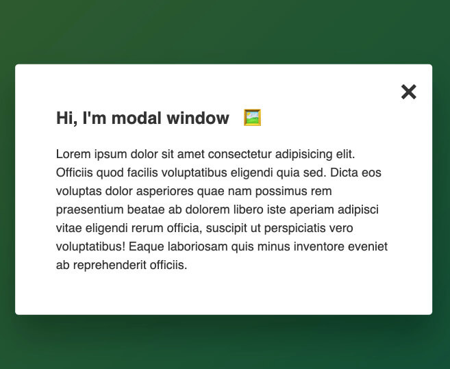

# UI component - modal window

This is a small project done as part of a Java Script course.

## Table of contents

- [Overview](#overview)
  - [Screenshot](#screenshot)
  - [Links](#links)
- [My process](#my-process)
  - [Built with](#built-with)
  - [What I learned](#what-i-learned)

## Overview

### The task

- Create small UI component Modal Window

### Screenshot

### Links

- Live Site URL: [https://semandr.github.io/modal_window/]

## My process

### Built with

- Semantic HTML5 markup
- Flexbox
- Native JavaScript

### What I learned

- Working with CSS classes from JavaScript
- Handling click events
- Handling keypress events
